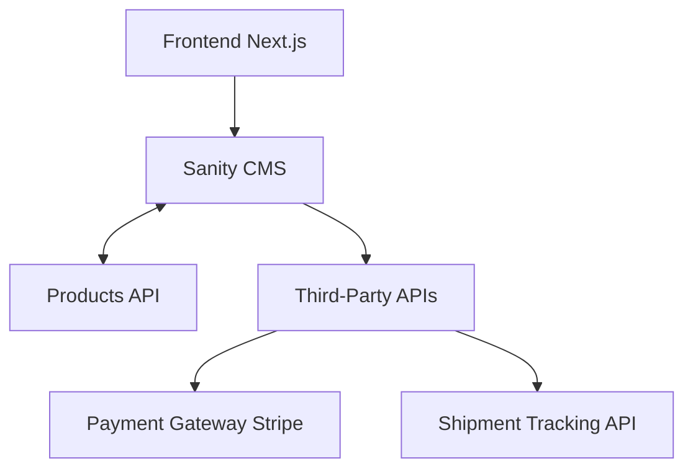

# 📜 Marketplace Technical Foundation - Leather Jacket Store
Welcome to my Marketplace Builder Hackathon 2025 project! 🎉 This repository showcases my journey in building a leatherOutWear E-commerce Marketplace. Over the next 7 days, I will document and develop features step-by-step to create a robust and user-friendly platform.
 
## 1. Technical Requirements 🛠️

 Based on Day 1’s business goals (selling high-quality leather jackets with a seamless experience), the technical requirements are as follows:

### Frontend Requirements 🖥️

 #### User-Friendly Interface:
  • 🖼️ Easy-to-navigate website for leather jackets.
 
  • 🔍 Showcase professional photos of jackets with zoom-in functionality.
  
 #### Responsive Design:📱💻
  • Optimized for both mobile and desktop users.
  
 #### Essential Pages:
  1. 🏠 Home Page: Highlights featured leather jackets.
  2. 🧥 Product Listings Page: Displays categories (e.g., men’s jackets, women’s jackets).
  3. 📄 Product Details Page: Shows a jacket's description, sizes, price, and stock availability.
  4. 🛒 Cart Page: Lists items added for purchase.
  5. 💳 Checkout Page: Includes a form for delivery information and payment processing.
  6. ✅ Order Confirmation Page: Displays a summary of the placed order.

 #### Backend Requirements (Sanity CMS) ⚙️
  • Use Sanity CMS for managing:
   1. 🧥 Products: Names, descriptions, prices, stock, sizes, and images.
   2. 📦 Orders: Customer information, product details, payment status, and order history.
   3. 👤 Customer Details: Store and retrieve customer names, emails, and addresses.

 #### Third-Party APIs🔌
  • 💰 Payment Gateway: Use Stripe for secure and reliable payment processing.
 
  • 🚚 Shipment Tracking API: Integrate a third-party API to update customers on order delivery status in real-time.

## 2. System Architecture 🌐

### System Overview 🛠️
 Here’s how the components of the marketplace interact:

 #### 1. Frontend (Next.js):
  • The user interacts with a modern and responsive interface.
 
  • Fetches product and order data dynamically via APIs.

 #### 2. Sanity CMS:
  • Acts as the database for products, orders, and customer information.
 
  • Provides APIs to interact with frontend components.

 #### 3. Third-Party APIs:
  • Payment Gateway (Stripe): Processes payments securely.
 
  • Shipment Tracking API: Tracks and displays the status of deliveries.
 
### System Architecture Diagram 🖼️



## 3. API Requirements 📡
Here are the endpoints and details based on the marketplace workflow:

### API Endpoints 🚀

| Endpoint         | Method | Purpose                     | Request/Response                                                                 |
|------------------|--------|-----------------------------|----------------------------------------------------------------------------------|
| `/products`      | GET    | Fetch all products          | 📄 `{ "id": 1, "name": "Jacket", "price": 150 }`                                 |
| `/product/:id`   | GET    | Fetch one product’s details | 📄 `{ "id": 1, "name": "Black Jacket", ... }`                                    |
| `/cart`          | POST   | Add item to cart            | 📦 `{ "productId": 123, "quantity": 1 }`                                         |
| `/checkout`      | POST   | Place an order              | 🛍️ `{ "customerInfo": {}, "cart": [] }`                                          |
| `/order/:id`     | GET    | Fetch order details         | ✅ `{ "orderId": 1, "status": "Shipped" }`                                       |
| `/shipment/:id`  | GET    | Track shipment              | 🚚 `{ "shipmentId": 123, "ETA": "2 Days" }`                                      |

## 4. Technical Documentation 📝

### Sanity Schema Examples

#### 1. Product Schema 🧥

```bash
export default {
  name: 'product',
  type: 'document',
  fields: [
    { name: 'name', type: 'string', title: 'Product Name' },
    { name: 'price', type: 'number', title: 'Price' },
    { name: 'stock', type: 'number', title: 'Stock Level' },
    { name: 'image', type: 'image', title: 'Product Image' },
    { name: 'description', type: 'text', title: 'Description' },
  ],
};
```
#### 2. Order Schema 📦

```bash
export default {
  name: 'order',
  type: 'document',
  fields: [
    { name: 'customer', type: 'reference', to: [{ type: 'customer' }], title: 'Customer' },
    { name: 'products', type: 'array', of: [{ type: 'reference', to: [{ type: 'product' }] }] },
    { name: 'paymentStatus', type: 'string', title: 'Payment Status' },
  ],
};
```

### Workflows 🔄

#### 1. Product Browsing 🧥

•  User visits the homepage or product listing page.

•  Frontend fetches data via `/products` API.

•  Products are displayed dynamically.

#### 2. Order Placement 🛒

•  User adds items to the cart (`/cart` endpoint).

•  User proceeds to checkout and places an order (`/checkout` endpoint).

•  Order details are saved in Sanity CMS.

#### 3. Shipment Tracking 🚚

•  Frontend sends a GET request to `/shipment/:id` endpoint.

•  Shipment status is displayed on the frontend.
